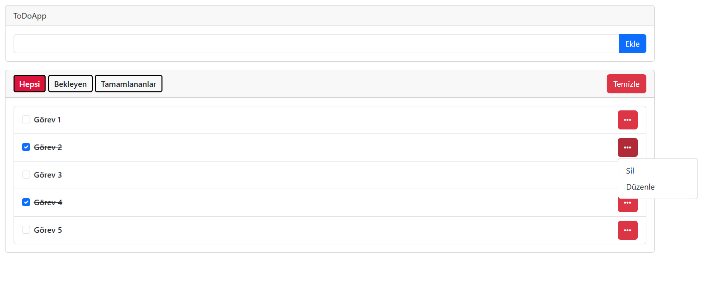

# 📝 ToDo App

A simple **ToDo List web application** that allows users to manage daily tasks.

Users can add tasks, mark them as completed, and delete them easily.

## 🚀 Features

- Add new tasks
- Mark tasks as completed
- Delete tasks
- Dynamic task list update
- Simple and clean UI

## 🛠️ Technologies Used

- HTML
- CSS
- JavaScript
- LocalStorage (for saving tasks)

## 📂 Project Structure

```
ToDoApp
 ├── index.html
 └── style.css
```

## ⚙️ Installation

Clone the repository

```
git clone https://github.com/velidogan120/ToDoApp.git
```

Open `index.html` in your browser.

## 🎯 Purpose

This project was built to practice:

- DOM manipulation
- JavaScript event handling
- LocalStorage usage
- Basic frontend development

## 📸 Screenshots

<p>
  
</p>

## 👨‍💻 Author

Veli Doğan
https://github.com/velidogan120
